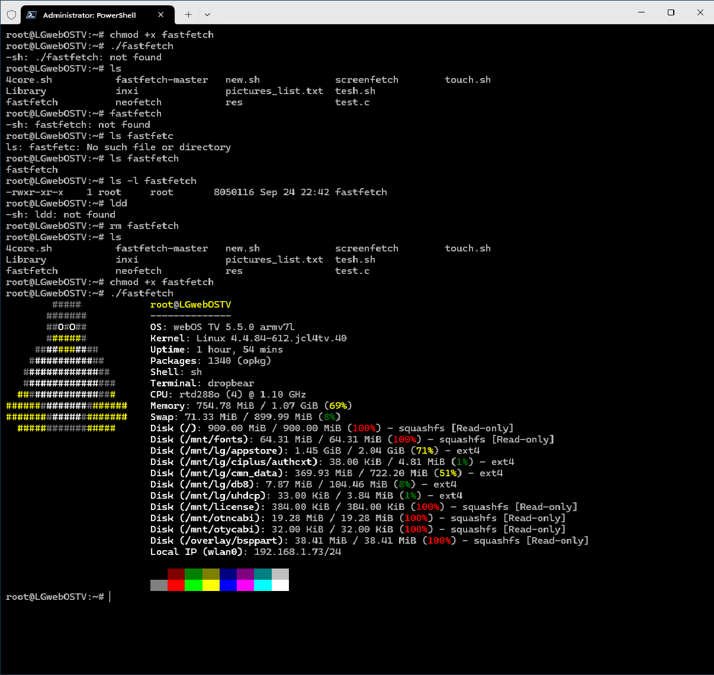

# fastfetch pre compiled builds

compiled build Fastfetch for some weird OS linux so you can run on your TV, ROUTER ...

## HOW to build IF you want

- REQ: LINUX (VM/WSL/REAL), INTERNET,TERMINAL

Package:

```bash
sudo apt install build-essential clang make git 
sudo add-apt-repository universe
sudo apt update
sudo apt install gcc-arm-linux-gnueabihf g++-arm-linux-gnueabihf
```

optional with APT-fast (replace apt➡️APT FAST)/ Inclease downlaod speed x8

```bash
sudo apt install aria2
sudo add-apt-repository ppa:apt-fast/stable
sudo apt update
sudo apt install apt-fast
```

Optional: CHATGPT,CLAUDE,COPILOT for quick helps

## ARM32 build

- file : `fastfetcharm32` will be able to run on any ARM32 LINUX
- REQ: ARM32 linux, Accessible to shell, ability to dump this fastfetch file into the OS
- Optional: ROOT (not neccessary) , CURL/WGET if you want to get this directly from github

### how to RUN

```bash
chmod +x fastfetcharm32
./fastfetcharm32
```

### Optional: HOW to build

- RUN and build

```bash
cmake .. \
  -DCMAKE_SYSTEM_NAME=Linux \
  -DCMAKE_SYSTEM_PROCESSOR=arm \
  -DCMAKE_C_COMPILER=arm-linux-gnueabihf-gcc \
  -DCMAKE_CXX_COMPILER=arm-linux-gnueabihf-g++ \
  -DCMAKE_C_FLAGS="-march=armv7-a -marm -mfpu=neon -mfloat-abi=hard" \
  -DCMAKE_CXX_FLAGS="-march=armv7-a -marm -mfpu=neon -mfloat-abi=hard" \
  -DCMAKE_EXE_LINKER_FLAGS="-static" \
  -DENABLE_IMAGEMAGICK=OFF \
  -DENABLE_RPM=OFF \
  -DENABLE_SQLITE3=OFF \
  -DENABLE_DBUS=OFF \
  -DENABLE_DCONF=OFF \
  -DENABLE_VULKAN=OFF \
  -DENABLE_X11=OFF \
  -DENABLE_WAYLAND=OFF \
  -DENABLE_OPENCL=OFF \
  -DENABLE_GLX=OFF \
  -DENABLE_EGL=OFF \
  -DENABLE_PULSE=OFF \
  -DENABLE_DDCUTIL=OFF \
  -DENABLE_DIRECTX_HEADERS=OFF \
  -DENABLE_ELF=OFF \
  -DENABLE_CHAFA=OFF

make 
```


