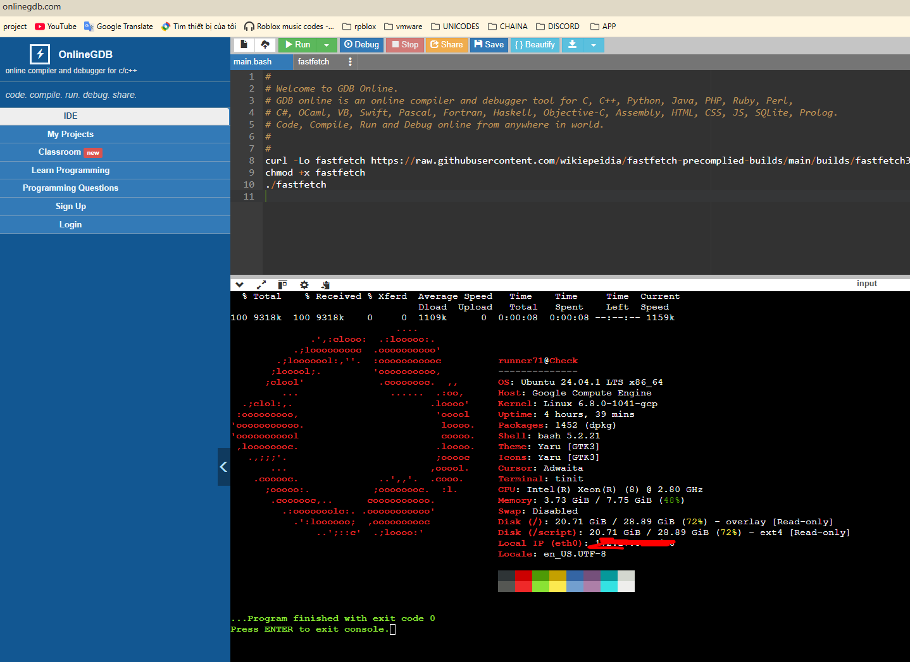

# fastfetch pre compiled builds

compiled build Fastfetch for some weird OS linux so you can run on your TV, ROUTER ...

## HOW to build IF you want

- REQ: LINUX (VM/WSL/REAL), INTERNET,TERMINAL

Packages:

```bash
sudo apt install build-essential clang make git 
sudo add-apt-repository universe
sudo apt update
sudo apt install gcc-arm-linux-gnueabihf g++-arm-linux-gnueabihf 
sudo apt install gcc-multilib g++-multilib
```

optional with APT-fast (replace apt➡️APT FAST)/ Inclease downlaod speed x8

```bash
sudo apt install aria2
sudo add-apt-repository ppa:apt-fast/stable
sudo apt update
sudo apt install apt-fast
```

Optional: CHATGPT,CLAUDE,COPILOT for quick helps

## common device req to run fastfetch

- LINUX
- Accessible to shell
- ability to dump this fastfetch file into the OS
- CPU: pentium MMX(unsure), any ARM32
-

## How to copy to device

run via SCP(ssh):

```bash
scp builds_you_want_besure_tobe_in_thesamedirectory user@ip:/path/you/want/
```

Device with CURL/WGET and INTERNET

```bash
curl -Lo fastfetch https://raw.githubusercontent.com/wikiepeidia/fastfetch-precomplied-builds/main/builds/buildsyouwant
chmod +x fastfetch
./fastfetch
```

```bash
wget -O fastfetch https://raw.githubusercontent.com/wikiepeidia/fastfetch-precomplied-builds/main/builds/buildsyouwant
chmod +x fastfetch
./fastfetch
```

Normal devices if package manager work, be sure to change APT to other package manager if you use different OS

```bash
sudo apt update
sudo apt install fastfetch
fastfetch
```

## ARM32 build

- file : `fastfetcharm32` will be able to run on any ARM32 LINUX
- REQ: ARM32 linux, Accessible to shell, ability to dump this fastfetch file into the OS
- Optional: ROOT (not neccessary) , CURL/WGET if you want to get this directly from github

### how to RUN

```bash
chmod +x fastfetcharm32
./fastfetcharm32
```

### Optional: HOW to build

- RUN and build

```bash
cmake .. \
  -DCMAKE_SYSTEM_NAME=Linux \
  -DCMAKE_SYSTEM_PROCESSOR=arm \
  -DCMAKE_C_COMPILER=arm-linux-gnueabihf-gcc \
  -DCMAKE_CXX_COMPILER=arm-linux-gnueabihf-g++ \
  -DCMAKE_C_FLAGS="-march=armv7-a -marm -mfpu=neon -mfloat-abi=hard" \
  -DCMAKE_CXX_FLAGS="-march=armv7-a -marm -mfpu=neon -mfloat-abi=hard" \
  -DCMAKE_EXE_LINKER_FLAGS="-static" \
  -DENABLE_IMAGEMAGICK=OFF \
  -DENABLE_RPM=OFF \
  -DENABLE_SQLITE3=OFF \
  -DENABLE_DBUS=OFF \
  -DENABLE_DCONF=OFF \
  -DENABLE_VULKAN=OFF \
  -DENABLE_X11=OFF \
  -DENABLE_WAYLAND=OFF \
  -DENABLE_OPENCL=OFF \
  -DENABLE_GLX=OFF \
  -DENABLE_EGL=OFF \
  -DENABLE_PULSE=OFF \
  -DENABLE_DDCUTIL=OFF \
  -DENABLE_DIRECTX_HEADERS=OFF \
  -DENABLE_ELF=OFF \
  -DENABLE_CHAFA=OFF

make 
```


## 86,64 builds

- file : `fastfetch32or64` will be able to run on any 86 OR 64 bit linux. It is a 32bit binary
- practical: for any devices couldnt use this command due to password issues or packages issues etc.

```bash
sudo apt install fastfetch
```

- REQ: 86/64 linux, internet, CURL,WGET.

### how to run

```bash
chmod +x fastfetch32or64
./fastfetch32or64
```

### how to biuld

- RUN and build

```bash
cmake .. \
  -DCMAKE_SYSTEM_NAME=Linux \
  -DCMAKE_SYSTEM_PROCESSOR=x86 \
  -DCMAKE_C_COMPILER=gcc \
  -DCMAKE_C_FLAGS="-m32" \
  -DCMAKE_EXE_LINKER_FLAGS="-static" \
  -DENABLE_IMAGEMAGICK=OFF \
  -DENABLE_RPM=OFF \
  -DENABLE_SQLITE3=OFF \
  -DENABLE_DBUS=OFF \
  -DENABLE_DCONF=OFF \
  -DENABLE_VULKAN=OFF \
  -DENABLE_X11=OFF \
  -DENABLE_WAYLAND=OFF \
  -DENABLE_OPENCL=OFF \
  -DENABLE_GLX=OFF \
  -DENABLE_EGL=OFF \
  -DENABLE_PULSE=OFF \
  -DENABLE_DDCUTIL=OFF \
  -DENABLE_DIRECTX_HEADERS=OFF \
  -DENABLE_ELF=OFF \
  -DENABLE_CHAFA=OFF

make -j$(nproc)
```



